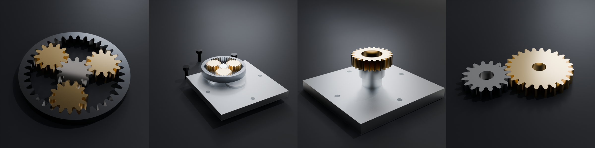
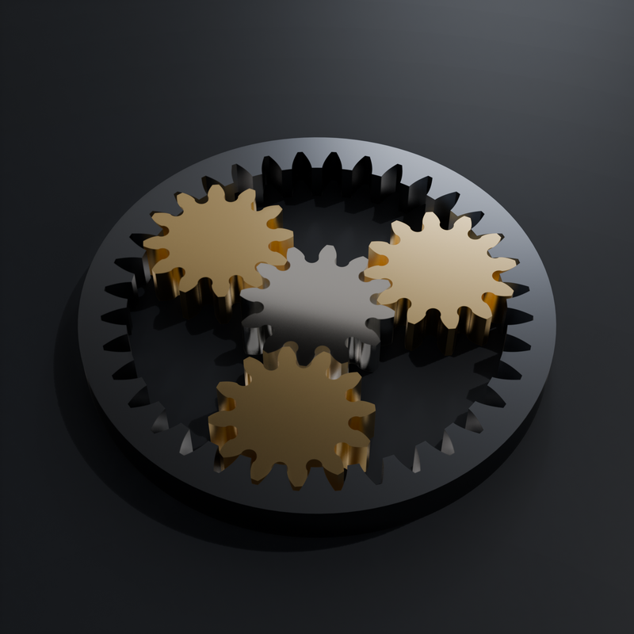
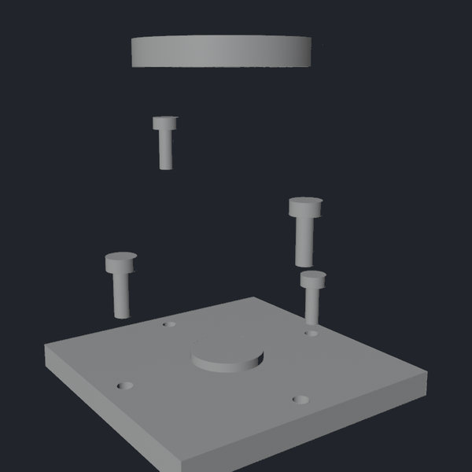
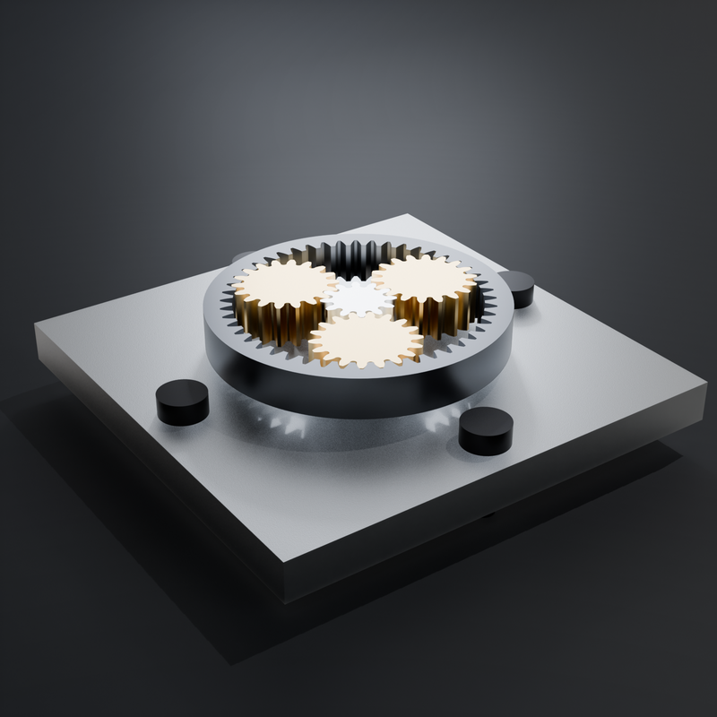
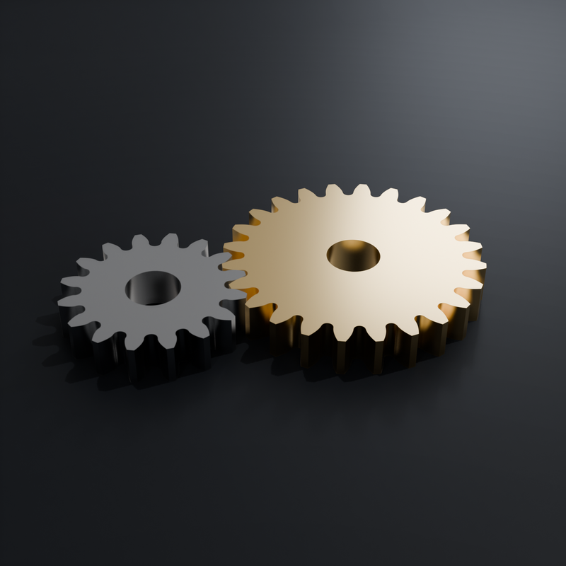
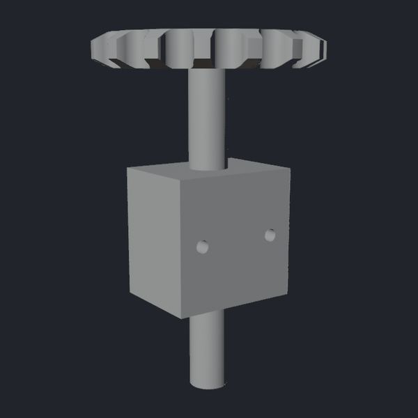
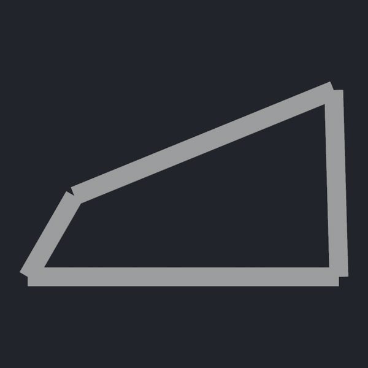
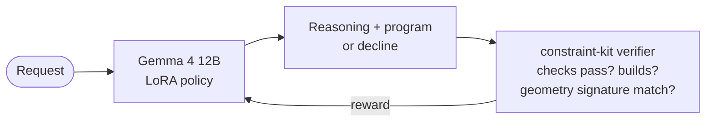
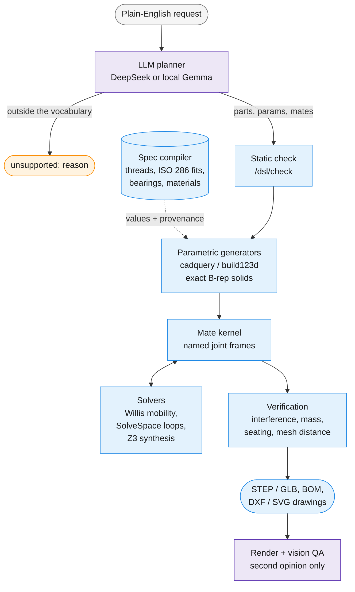

# constraint-kit

**Describe a mechanism in plain English. Get exact, manufacturable CAD back: STEP files, real B-rep geometry,
not a mesh an AI guessed at.**



```text
"a plate with a spacer and a 24-tooth gear stacked on its boss"
```
→ e.g. a 100×100 mm aluminum plate with a 4-bolt circle, a spacer on the boss, and a module-2 24-tooth steel spur
gear seated on the spacer with **zero gap** (a real run; the planner picks sensible values). Out come STEP + GLB, mass properties, a BOM, and a render.

## Why it's different

Most text-to-CAD asks a model to produce geometry, then hopes. constraint-kit splits the job:

> **The AI handles meaning. Deterministic math handles geometry.** The LLM only decides *which* parts, *which*
> parameters, and *what connects to what*. Parametric generators build exact B-rep solids, and a
> deterministic mate kernel puts every part in place. The model never places a single vertex.

So the results can be **checked**, not just looked at:

- **Gears actually mesh.** Center distances come from module × teeth, not from eyeballing.
- **Parts actually seat.** Mates are solved against named joint frames that survive parameter changes.
- **Collisions are caught.** A bounding-box prefilter is followed by an exact OpenCascade boolean clash check.
- **Mechanisms are solved properly.** Planetary mobility uses Willis' equation, linkages use SolveSpace, and
  gear-train and tolerance synthesis use a Z3 SMT solver.

### It says "no" instead of guessing

Ask for something outside its vocabulary and it declines, and says why:

```text
"Need a spiral bevel gear for a heavy-duty application."
→ {"unsupported": "only straight bevel gears are modeled"}
```

A plausible-looking wrong part is worse than no part. Honest declines are a first-class, measured output, not
an error path.

## Gallery

| | | |
|:-:|:-:|:-:|
|  |  |  |
| Planetary gearset: sun, three planets, ring | Gearbox, exploded view | Same gearbox, assembled |
|  |  |  |
| Spur pair at the exact center distance | Gear on a shaft through a housing | Four-bar linkage |

Every image above is a real build, with STEP geometry behind it. The development pipeline has built more than
1,400 verified assemblies.

## A local model that knows when to decline

[**gemma-4-12b-constraintkit**](https://huggingface.co/jajmangold/gemma-4-12b-constraintkit-GGUF) is a Gemma 4 12B fine-tune (SFT + GRPO with the geometry verifier as
the reward) that writes constraint-kit programs directly from plain English, on one local GPU:

| | Builds (geometry-verified) | Honest declines |
|---|:-:|:-:|
| SFT, held-out probes | **93%** | **87%** |
| + GRPO | builds held at 6/6 | 9/10 (silent wrong builds halved) |



No reward model and no LLM judge. The reward is whether the CAD actually checks out.

It performs in the same range as a prompted frontier model, shows its reasoning, and runs as a 9.8 GB GGUF.
It's optional: constraint-kit runs on a hosted LLM out of the box. Training scripts are in [`training/`](training/).

## Features

- **Natural language → CAD**: describe an assembly in plain English, get exact STEP/GLB output
- **Four solver classes**: deterministic tree mates, analytical gear mobility (Willis), geometric loops (SolveSpace), discrete synthesis (Z3/SMT)
- **Real engineering parts**: gears, extrusions, bearings, fasteners, plumbing via build123d/bd_warehouse
- **First-class oriented joints**: named mate frames that survive parameter changes (no selector drift)
- **Spec compiler**: on-demand engineering-fact resolution with provenance (threads, ISO 286 fits, bearings, materials)
- **Hierarchical assemblies**: recursive subassemblies with ports, BOM roll-ups, mass properties
- **Top-down design**: requirements → derived parameters → geometry, with incremental re-solve
- **Engineering drawings**: 2D drawing sets (DXF + SVG), exploded views, 2D layouts → DXF for laser/CNC
- **113 regression tests**, every one checked against geometry, never against a vision model's opinion

## Quick start

The planner and vision QA default to [DeepSeek's API](https://api-docs.deepseek.com/), so you need a key:

```bash
export DEEPSEEK_API_KEY=sk-...
```

### With Docker (recommended)

```bash
docker compose -f cadkit/docker-compose.yaml up -d --build
curl -s http://127.0.0.1:8195/health
```

### Without Docker

```bash
pip install -e ".[all]"
uvicorn constraint_kit.api:app --host 127.0.0.1 --port 8195
```

### First assembly

```python
import httpx

r = httpx.post("http://127.0.0.1:8195/build", json={
    "request": "a plate with a spacer and a 24-tooth gear stacked on its boss"
})
print(r.json())
```

Or via the CLI:

```bash
curl -X POST http://127.0.0.1:8195/build \
  -H "Content-Type: application/json" \
  -d '{"request": "a plate with a spacer and a 24-tooth gear stacked on its boss"}'
```

## Environment variables

| Variable | Default | Description |
|---|---|---|
| `DEEPSEEK_API_KEY` | — | **Required** for the default DeepSeek backend (`LLM_API_KEY` also works) |
| `LLM_BASE_URL` | `https://api.deepseek.com` | OpenAI-compatible LLM endpoint for planning + vision QA. Set to a local vLLM / llama.cpp URL (e.g. `http://localhost:8000/v1`) to self-host |
| `MODEL_PLANNER` | `deepseek-v4-pro` | Model that turns requests into assembly specs |
| `MODEL_VLM` | `deepseek-flash` | Vision model for render QA and table extraction (must accept images) |
| `PLANNER_URL` / `VLM_URL` | `LLM_BASE_URL` | Optional per-role endpoint overrides |
| `SPEC_SEARCH_URL` | `http://localhost:8080` | SearXNG instance for spec compiler discovery |
| `CK_WORK_DIR` | `/tmp/constraint-kit` | Working directory for outputs and caches |
| `NEO4J_PASS` | `changeme` | Neo4j password (optional, for atlas persistence) |
| `BLENDER_IMAGE` | `blender:latest` | Docker image for GLB rendering |
| `SPEC_DB_PATH` | `<work_dir>/spec_store.sqlite` | SQLite path for spec compiler cache |
| `SPEC_CACHE_DIR` | `<work_dir>/spec_cache` | JSON artifact dump for spec resolutions |

## Architecture



Purple is where the AI makes a judgment. Blue is deterministic and reproducible: the same program gives the
same geometry every time. Vision QA can flag a render, but it never overrides the geometric checks.

**Doctrine**: AI for semantics, deterministic geometry for placement. The LLM proposes; exact geometry + the mate kernel dispose.

## API

All endpoints on `127.0.0.1:8195` (host-only by default).

### Core

| Method | Endpoint | Description |
|---|---|---|
| `GET` | `/health` | Health check + atlas status |
| `POST` | `/plan` | LLM spec only (no build) |
| `POST` | `/build` | Plan + assemble in one shot |
| `POST` | `/assemble` | Build from a spec |
| `POST` | `/qa` | Attach render + verdict to a stored assembly |

### 2D Layout

| Method | Endpoint | Description |
|---|---|---|
| `POST` | `/layout2d` | Plan/solve a 2D layout → DXF + PNG |
| `POST` | `/layout_qa` | Attach a layout verdict |

### DOF Solvers

| Method | Endpoint | Description |
|---|---|---|
| `POST` | `/dof/planetary` | Gear-loop mobility (Willis) |
| `POST` | `/dof/four_bar` | 4-bar linkage (SolveSpace) |
| `POST` | `/dof/slider_crank` | Slider-crank (SolveSpace) |
| `POST` | `/mechanism/four_bar` | Pose a 4-bar as an assembly |

### Design

| Method | Endpoint | Description |
|---|---|---|
| `POST` | `/design` | Top-down parametric design |
| `POST` | `/design/reedit` | Incremental re-solve (changed requirements) |
| `POST` | `/assembly/tree` | Hierarchical assembly with subassemblies |
| `POST` | `/assembly/bom` | Bill of Materials (md/csv) |
| `POST` | `/assembly/interference` | Clash detection |
| `POST` | `/assembly/explode` | Exploded view |
| `POST` | `/assembly/drawing` | 2D drawing set (DXF + SVG) |

### Intent & DSL

| Method | Endpoint | Description |
|---|---|---|
| `POST` | `/intent/design` | NL → intent → build |
| `POST` | `/intent/resolve` | Resolve intent → canonical form |
| `POST` | `/dsl/check` | Static validation of a DSL program |
| `POST` | `/dsl/verify` | Geometric equivalence check |

### Synthesis

| Method | Endpoint | Description |
|---|---|---|
| `POST` | `/synthesize/planetary` | SMT gear-train synthesis to a ratio spec |
| `POST` | `/synthesize/tolerance` | SMT tolerance allocation |
| `POST` | `/synthesize/gear_train` | Multi-stage gear synthesis |

### Spec Compiler

| Method | Endpoint | Description |
|---|---|---|
| `POST` | `/spec/resolve` | Resolve an engineering fact |
| `POST` | `/spec/validate` | Schema-check a fact |
| `POST` | `/spec/search` | Debug SearXNG discovery |
| `GET` | `/spec/cache` | Recent SQLite resolutions |

### Design Rules

| Method | Endpoint | Description |
|---|---|---|
| `POST` | `/rules/fastener_engagement` | Engagement check |
| `POST` | `/rules/fit` | Fit check |
| `POST` | `/rules/clearance` | Min-gap check |
| `POST` | `/rules/beam_bending` | Cantilever stress/deflection |
| `POST` | `/rules/bolt_preload` | Bolt proof load + preload |

## Part vocabulary

**Native parts** (`parts.py`): `plate`, `spur_gear`, `ring_gear`, `planetary_gearset`, `spacer`, `shaft`, `bolt`, `nut`, `washer`, `bearing`, `threaded_rod`, `link`, `adapter`, `housing`, `sheet_bracket`, `panel`, `four_bar`

**Catalog parts** (`parts_bd.py`): `extrusion` (V-slot 2020/2040), `ball_bearing`, `screw` (ISO), `bearing_block`, `sprocket`, `flange`, `pipe`

**Mates**: `coincident`, `rigid`, `contact`, `mesh`, `revolute`, `cylindrical`

## Running tests

```bash
# Inside the cadkit container:
tests/run.sh

# Or directly (needs cadquery + build123d):
python3 tests/test_kernel.py
```

113 tests, all verified against geometric ground truth (seating zero-gap, gear center distances, mass vs density, STEP/GLB export, DXF validity, atlas round-trip).

## Project structure

```
constraint_kit/        # the Python package
  parts.py             # native 3D parametric generators
  parts_bd.py          # build123d/bd_warehouse catalog parts
  parts2d.py           # 2D footprint generators
  joints.py            # oriented mate frames
  mate_intent.py       # semantic intent → concrete frames
  mates.py             # deterministic mate kernel
  layout.py            # 2D layout solver + DXF export
  builder.py           # leaf assembly builder
  assembly.py          # hierarchical assemblies + BOM
  parameters.py        # top-down parametric design
  synthesis.py         # SMT design synthesis (Z3)
  spec_compiler.py     # engineering-fact resolution
  api.py               # FastAPI server
  ...
cadkit/                # Dockerfile + docker-compose
drivers/               # orchestration scripts
tests/                 # regression suite
training/              # Gemma 4 fine-tuning
tools/                 # utilities
libraries/             # reusable assembly defs
```

## License

MIT
